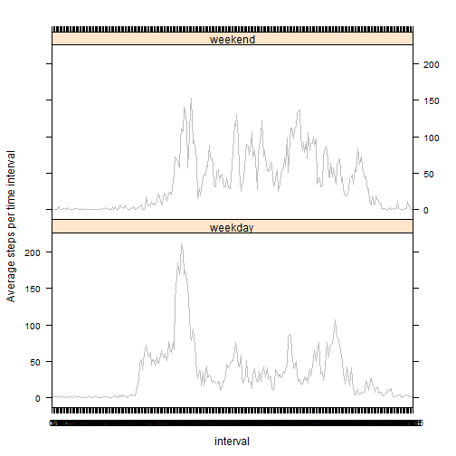

Reproducible Research: Peer Assessment 1
=============================================
This assignment makes use of data from a personal activity monitoring device. This device collects data at 5 minute intervals through out the day. The data consists of two months of data from an anonymous individual collected during the months of October and November, 2012 and include the number of steps taken in 5 minute intervals each day.

##Step 1: Loading and preprocessing the data
Using the "read.csv" function:

```r
path_mydir = "D:\\data analysis\\reproducible research\\project 1"
setwd(path_mydir)
data<-read.csv("./activity.csv")
```
A first view of the data:

```r
str(data)
```

```
## 'data.frame':	17568 obs. of  3 variables:
##  $ steps   : int  NA NA NA NA NA NA NA NA NA NA ...
##  $ date    : Factor w/ 61 levels "2012-10-01","2012-10-02",..: 1 1 1 1 1 1 1 1 1 1 ...
##  $ interval: int  0 5 10 15 20 25 30 35 40 45 ...
```

```r
summary(data)
```

```
##      steps               date          interval   
##  Min.   :  0.0   2012-10-01:  288   Min.   :   0  
##  1st Qu.:  0.0   2012-10-02:  288   1st Qu.: 589  
##  Median :  0.0   2012-10-03:  288   Median :1178  
##  Mean   : 37.4   2012-10-04:  288   Mean   :1178  
##  3rd Qu.: 12.0   2012-10-05:  288   3rd Qu.:1766  
##  Max.   :806.0   2012-10-06:  288   Max.   :2355  
##  NA's   :2304    (Other)   :15840
```

```r
tail(data)
```

```
##       steps       date interval
## 17563    NA 2012-11-30     2330
## 17564    NA 2012-11-30     2335
## 17565    NA 2012-11-30     2340
## 17566    NA 2012-11-30     2345
## 17567    NA 2012-11-30     2350
## 17568    NA 2012-11-30     2355
```
## What is mean total number of steps taken per day?
1. Make a histogram of the total number of steps taken each day

```r
hist_data<-aggregate(data$steps, by=list(data$date), sum, na.rm=TRUE)
names(hist_data) = c("date", "steps")
hist(hist_data$steps,xlab="Total number of steps taken each day", breaks=20, col="grey", border="darkgrey", main="" )
```

 

2.Calculate and report the mean and median total number of steps taken per day

```r
mean<-mean(hist_data$steps)
median<-median(hist_data$steps)
```
The mean of total number of steps taken per day is 9354.2295. The median of total number of steps taken per day is 10395

## What is the average daily activity pattern?
1. Make a time series plot (i.e. type = "l") of the 5-minute interval (x-axis) and the average number of steps taken, averaged across all days (y-axis)


```r
data$interval=as.factor(data$interval)
intvl_data=aggregate(data$steps, by=list(data$interval), mean, na.rm=TRUE)
names(intvl_data) = c("interval","avg.steps")
plot(1:288,intvl_data$avg.steps, xlab="Interval", ylab="Avg.steps/int", xlim=c(0,288), ylim=c(0,max(intvl_data$avg.steps)), xaxs="i", type="l", col="grey")
```

 


2.Which 5-minute interval, on average across all the days in the dataset, contains the maximum number of steps?


```r
interval_max.steps = intvl_data[which.max(intvl_data$avg.steps),]
interval_max.steps
```

```
##     interval avg.steps
## 104      835     206.2
```

## Imputing missing values
1. Calculate and report the total number of missing values in the dataset (i.e. the total number of rows with NAs)

This was done by computing the number of rows from the original data frame that had NA values for the "steps" variable; in total, there are the following number of missing values:

```r
nrow(data[is.na(data$steps)==TRUE,])
```

```
## [1] 2304
```

2.Devise a strategy for filling in all of the missing values in the dataset. The strategy does not need to be sophisticated. For example, you could use the mean/median for that day, or the mean for that 5-minute interval, etc.
&
3.Create a new dataset that is equal to the original dataset but with the missing data filled in.

Using the "zoo" library and the "na.approx" function, we can fill in the missing values. The computation of the new dataset is presented below:


```r
library(zoo)
```

```
## Warning: package 'zoo' was built under R version 3.1.1
```

```
## 
## Attaching package: 'zoo'
## 
## The following objects are masked from 'package:base':
## 
##     as.Date, as.Date.numeric
```

```r
new.data<-data

new.data$steps = na.approx(new.data$steps, na.rm=FALSE)
still_na= new.data[is.na(new.data$steps)==TRUE,]
still_na= match(still_na$interval, intvl_data$interval)
still_na = intvl_data$avg.steps[still_na]
new.data$steps[is.na(new.data$steps)==TRUE] = still_na
```
A brief overview of the newly created data:

```r
str(new.data)
```

```
## 'data.frame':	17568 obs. of  3 variables:
##  $ steps   : num  1.717 0.3396 0.1321 0.1509 0.0755 ...
##  $ date    : Factor w/ 61 levels "2012-10-01","2012-10-02",..: 1 1 1 1 1 1 1 1 1 1 ...
##  $ interval: Factor w/ 288 levels "0","5","10","15",..: 1 2 3 4 5 6 7 8 9 10 ...
```

```r
summary(new.data)
```

```
##      steps               date          interval    
##  Min.   :  0.0   2012-10-01:  288   0      :   61  
##  1st Qu.:  0.0   2012-10-02:  288   5      :   61  
##  Median :  0.0   2012-10-03:  288   10     :   61  
##  Mean   : 33.7   2012-10-04:  288   15     :   61  
##  3rd Qu.:  8.0   2012-10-05:  288   20     :   61  
##  Max.   :806.0   2012-10-06:  288   25     :   61  
##                  (Other)   :15840   (Other):17202
```

```r
tail(new.data)
```

```
##        steps       date interval
## 17563 2.6038 2012-11-30     2330
## 17564 4.6981 2012-11-30     2335
## 17565 3.3019 2012-11-30     2340
## 17566 0.6415 2012-11-30     2345
## 17567 0.2264 2012-11-30     2350
## 17568 1.0755 2012-11-30     2355
```

4. Make a histogram of the total number of steps taken each day and Calculate and report the mean and median total number of steps taken per day. Do these values differ from the estimates from the first part of the assignment? What is the impact of imputing missing data on the estimates of the total daily number of steps?


```r
hist_data_new<-aggregate(new.data$steps, by=list(new.data$date), sum, na.rm=TRUE)
names(hist_data_new) = c("date", "steps")
hist(hist_data_new$steps,xlab="Total number of steps taken each day", breaks=20, col="grey", border="darkgrey", main="" )
```

 


```r
mean_new<-mean(hist_data_new$steps)
median_new<-median(hist_data_new$steps)
```
The new values for mean and median are 9707.2193 and 1.0571 &times; 10<sup>4</sup>. The old values for mean and median (with NAs still existing in the data frame) were 9354.2295 and 10395. Therefore, we can conlcude that the imputation of missing data has a substantial impact on mean and median values.

## Are there differences in activity patterns between weekdays and weekends?
1. Create a new factor variable in the dataset with two levels - "weekday" and "weekend" indicating whether a given date is a weekday or weekend day.


```r
new.data$type = weekdays(as.Date(new.data$date))
new.data$type = ifelse(new.data$type == "Saturday" | new.data$type == "Sunday", "weekend", "weekday")
new.data$type = as.factor(new.data$type)
```

2. Make a panel plot containing a time series plot (i.e. type = "l") of the 5-minute interval (x-axis) and the average number of steps taken, averaged across all weekday days or weekend days (y-axis).


```r
new.data$interval= as.factor(new.data$interval)
new.data_avg= aggregate(new.data$steps, by=list(new.data$interval,new.data$type), mean, na.rm=TRUE)
names(new.data_avg) = c("interval", "type", "avg.steps")

library(lattice)
xyplot(avg.steps ~ interval | type, data=new.data_avg, layout=c(1,2), type="l", ylab="Average steps per time interval", col="grey")
```

 

Based on the graph above, it can be stated that weekends tend to have more evenly distributed number of steps/interval, but weekdays have higher average values of steps.
